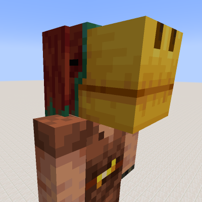

# More Mob Heads for Minecraft 1.20.1 #

More Mob Heads is a mod for Minecraft that adds in mob heads for every mob in the game, including all variants.
All heads use the models based on the mobs' vanilla models and many of them have animations when powered.
As the mod uses only vanilla textures, all heads change with their corresponding mobs when a texture pack is used.

Additionally, each mob has its own instrument that can be played by placing their head on a note block (similar to the vanilla feature introduced in 1.20 for the vanilla mob heads)